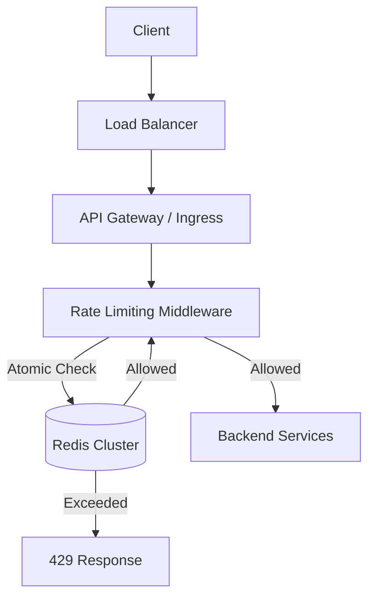

# System Architecture: Rate Limiter

This document outlines the architecture, data structures, and edge-case handling for the production-grade rate limiter.

## 1. Request Flow

## 2. Algorithm: Sliding Window Log
We implement a **Sliding Window Log** algorithm using Redis Sorted Sets (`ZSET`). This is superior to standard Fixed Window algorithms because it eliminates the "boundary burst" problem where a user can send 100 requests at 0:59 and 100 requests at 1:00, effectively sending 200 requests within a 2-second span.

### Data Structure
- **Key**: `rate_limit:{apikey_or_ip}`
- **Member**: `{timestamp_ms}-{randomizer}`
- **Score**: `{timestamp_ms}`

### Lua Atomicity
Because fetching the current count, removing old requests, and adding a new request requires multiple commands, doing this in standard Node.js logic risks race conditions when multiple concurrent requests hit different backend instances. 

We solve this using a **Redis Lua Script**, which Redis executes atomically.

## 3. Tier Management
The API provides three tiers. The tier limits are applied dynamically based on the authenticated user's profile:
- **Free**: 100 req / minute
- **Pro**: 1,000 req / minute
- **Enterprise**: Configured via Env `ENTERPRISE_LIMIT`

## 4. Edge Cases & Resilience

| Edge Case | Handling Strategy |
|-----------|-------------------|
| **Redis Outage** | Implements a **Fail-Open** strategy (configurable via `RATE_LIMIT_FAIL_OPEN=true`). If Redis crashes, we allow traffic to pass through rather than causing a complete API outage. |
| **Distributed Race Conditions** | Prevented entirely by the atomic Lua script. |
| **Memory Leaks** | The Lua script actively applies a `PEXPIRE` TTL to the sorted set matching the window size, ensuring inactive keys are purged. |
| **Clock Drift** | We rely strictly on the Node.js application server timestamp (`Date.now()`) as the source of truth for the sliding window score to mitigate Redis vs. AppServer clock drift. |

## 5. Security & DDoS Protection
While this middleware protects application-level resources, a true production deployment should also include infrastructural protection:
1. **WAF (Web Application Firewall)**: AWS WAF or Cloudflare should handle volumetric DDoS attacks before they reach the Node.js layer.
2. **IP Blacklisting**: Extremely aggressive IPs should be temporarily blocked at the Load Balancer level.
